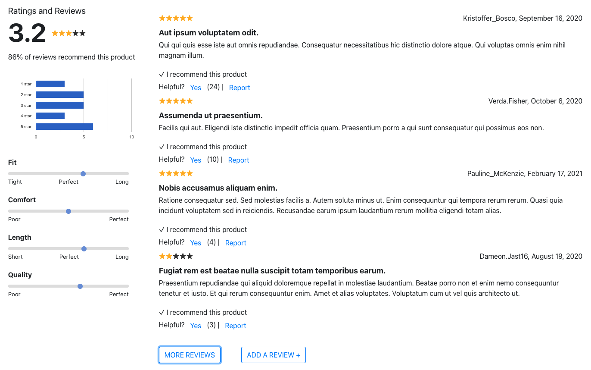

# About
Project Catwalk is a front-end design for a ficticious e-commerce website. Users can browse through stylish clothing options and add them to their cart. They can also read through questions and answers submitted by previous shoppers. Users can even view product ratings and reviews and submit their own. My specific area of responsibility on this project was the ratings and reviews section at the bottom of the page.

# Authors
* Johnny Frame (@jbframe)
* Graham Kirsch (@21grahams)
* Mason Hoffman (@mhoffman39)

# Screenshot

# Built With
1. React
2. NodeJS
3. HTML
4. CSS
5. React Bootstrap
6. React Router
7. Material UI
8. Axios
9. Moment
10. Jest
11. Enzyme
12. Express

# Running this application
Open a terminal in root directory then execute the following commands:
###### `$ cd my-app`
###### `$ npm install`
###### `$ npm run watch`

Open a second terminal in root directory then execute the following commands:
###### `$ cd my-app`
###### `$ npm run server`

Open http://localhost:3000 in a web browser. Product '18201' will load by default. View different products by modifying the url with the product id you wish to view (eg: http://localhost:3000/18209).
